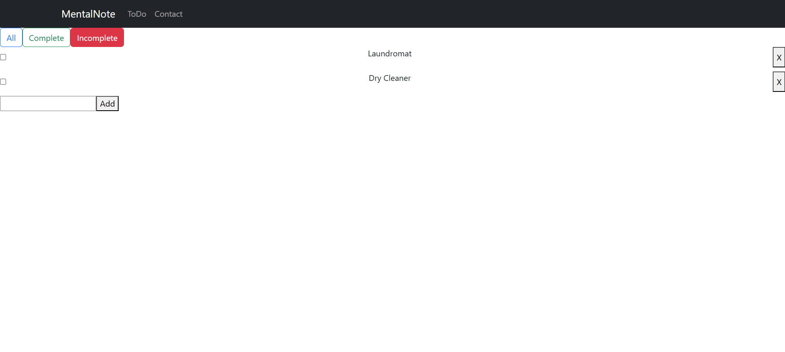
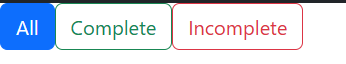
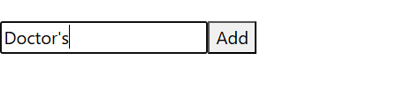
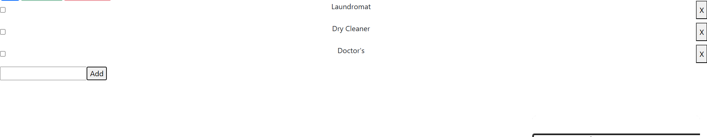
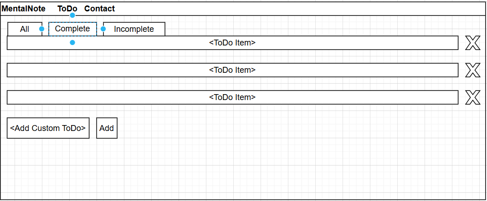
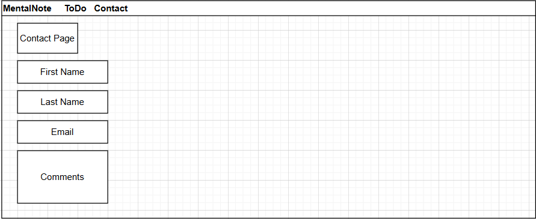

# Matt Styles

## MentalNote, the ToDo List App

## This app will allow users to create, delete, and filter through a list of ToDo items.  

## The user is greeted by a Navbar that allows them to navigate between two pages: ToDo and Contact. 

## Under ToDo, the user will see a list of their ToDo items. Here they can delete or mark them as completed.

## The filter buttons at the top will display only completed or incomplete ToDo items.  

## The user can then add a custom ToDo as well. 

## The user can easily note completed ToDos with a markthrough effect. 

## Technologies include: HTML, CSS, Javascript, React, and Git/Github. 

## User stories:
- As a user, I want to view all of my ToDo items in a transformable list. 
- As a user, I want to be able to delete ToDo items, add new ToDo items, and mark items completed with a simple markthrough effect. 
- As a user, I want to be able to filter ToDos between completed and incomplete. 

## Wireframe: 

## Future Improvements: 
- Calendar tab to save ToDo items.
- More stylization to bring an elegant aesthetic to the app. 
- More filtering options like categeories for importance, type, etc.  

## LinkedIn:
www.linkedin.com/in/matt-styles-2a079a255